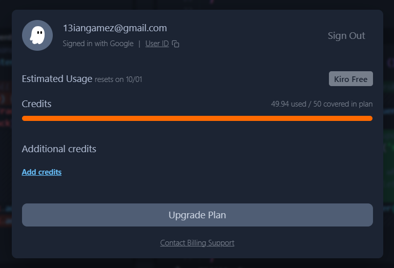

## Kiro Credit Budget

Use the available 50-credit Kiro budget as fully as practical while keeping a safety margin of 1–5 credits.

- Target total usage: **45–49 credits**.
- Never exceed the 50-credit limit.
- Do not stop after producing only a basic first version when enough credits remain for useful improvements.
- Use the initial credits to implement the complete portfolio and all required interactions.
- Use the remaining budget for responsive refinements, accessibility, navigation edge cases, content layout, SVG-logo checks, missing-asset behavior, code review, and final verification.
- Fix discovered defects before spending credits on optional visual polish.
- Do not add unrelated sections, frameworks, packages, dependencies, or invented personal information merely to consume credits.
- Reserve enough credit for a final full-project review and corrections.
- Finish when every requirement is implemented and verified, even if exact platform-side credit accounting prevents reaching the target precisely.

Kiro must report its approximate credits used and remaining at the end if that information is available in its interface. Exact credit consumption depends on Kiro’s own accounting, so this is a usage target rather than a guarantee.



# Personal Portfolio — Complete Build Requirements

Create a complete, responsive, frontend-only personal portfolio website for Ian Gamez.

Treat this document as the source of truth. Use only verified information supplied here. Leave unknown contact details, project links, dates, images, and documents empty rather than inventing them.

## Technology Stack

Use only:

- HTML5
- CSS3
- Vanilla JavaScript

The finished website must work by opening `index.html` directly and must not require installation, compilation, or a local server.

Do not use:

- Vite or another build tool
- npm packages or package managers
- React, Vue, Angular, or another frontend framework
- TypeScript for the website implementation
- CSS frameworks or component libraries
- A backend or database
- Authentication or user accounts
- An administration dashboard or CMS
- A server-based contact form
- External fonts, icon scripts, or runtime dependencies

Other technologies may appear as portfolio skills or project tags, but they must not be dependencies of the portfolio itself.

## Required Files

```text
mainKiroFile/
├── index.html
├── styles.css
├── script.js
├── README.md
└── assets/
    ├── icons/
    │   ├── favicon.svg
    │   └── tech/
    ├── images/
    │   ├── profile/
    │   ├── projects/
    │   ├── hobbies/
    │   └── backgrounds/
    └── documents/
```

Keep all editable portfolio information in a single `portfolioData` object near the top of `script.js`. Ian must be able to update text, skills, projects, links, and image paths without changing the rendering or navigation code.

## Personal Information

- **Name:** Ian Gamez
- **Title:** Junior Computer Science Student
- **Education:** Bachelor of Science in Computer Science, Junior Year
- **School:** University of Saint Louis Tuguegarao
- **Experience:** Website building, freelance development, and application development
- **Hobbies:** Volleyball, private aviation, stocks, and cryptocurrency
- **Special achievement:** Licensed private pilot
- **Website type:** Static frontend-only portfolio

## Design Direction

Create a minimal black-and-white editorial design inspired by the feel of an offline dinosaur pixel game.

Use:

- A white background and dark text
- Strong typography with system-font fallbacks
- Generous whitespace
- Clean borders and restrained grayscale surfaces
- Original pixel-art details
- Clear hierarchy
- Responsive layouts
- Subtle motion
- Small locally stored SVG technology logos

Create original dinosaur and scenery artwork. Do not copy the official Chrome dinosaur sprite, proprietary artwork, or source code. Keep decorative elements subtle and prevent them from overlapping text, images, navigation, or controls.

## Website Sections

Create these sections in order:

```text
Hero → About → Skills → Projects → Experience → Education → Hobbies → Contact
```

Every section must have a unique ID, clear heading, short introduction, accessible navigation target, and responsive layout. About, Skills, Projects, Experience, Education, and Hobbies must include a vertically scrollable detail area.

## Hero

Introduce Ian as a junior Computer Science student, website builder, and explorer. Include links to Projects and About. Use the original pixel dinosaur as a prominent visual element without obscuring the introduction.
